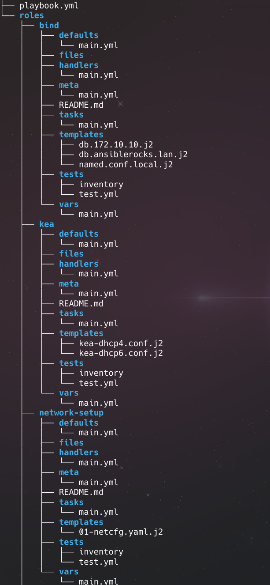
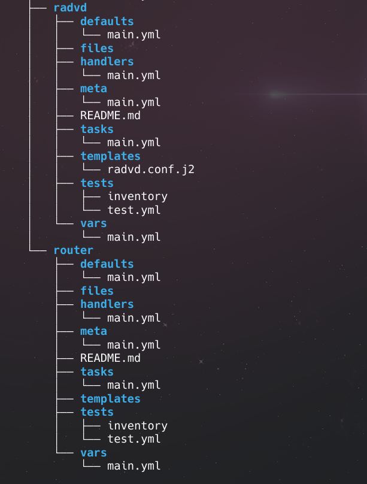

## Playbook de Ansible de Kea, Bind, Radvd y iptables:

Con este playbook se implementa un servidor dhcp(kea), un servidor dns(bind) y unas reglas de iptables para redireccionar tráfico de una red interna al exterior, todo con soporte ipv6.

### Requisitos

Necesitaremos una máquina debian con las siguientes carácterísticas:
- Dos interfaces de red que serán:
  - wan: será el que tenga salida al exterior desde la red interna y por la que conecta ansible. Esta deberá estar previamente configurada con ip estática o dhcp con reserva.
  - lan: será el adaptador para la red interna y por el que se servirá dhcp y dns. Se configurará mediante un rol en el playbook.
- Instalado el paquete de python
- Instalado y configurado el servidor de ssh para la autentificación por claves.

### Estructura de directorios.



Los roles usados serán:

- network-setup: Configura el segundo adaptador de red utilizando `netplan`.
- kea: Instala y configura el servidor DHCP `kea`.
- radvd: Instala y configura `Router Advertising Daemon` para poder tener un gateway ip6.
- bind: Instala y configura el servidor DNS `bind9`.
- router: Establece unas reglas en `iptables`.

### Playbook principal

Establece unas variables globales e invoca los roles a ejecutar:

**playbook.yml**
```yaml
- name: Instalar y configurar DHCP (Kea) y DNS (BIND)
  hosts: all
  become: true
  roles:
    - network-setup
    - kea
    - bind
    - router
    - radvd
```

**group_vars/all**

```yml
ansible_user: root
server_ip: "172.10.10.254"
domain: ansiblerocks.lan
lan_iface: ens19
wan_iface: ens18
```

### Rol network-setup

En este rol se instala `netplan`y se configuran ambas interfaces de red con ip estática, volcando una plantilla con los permisos adecuados y se aplica la configuración:

**taks/main.yml**

```yaml
- name: Instalar Netplan (por si no está)
  apt:
    name: netplan.io
    state: present
    update_cache: yes

- name: Copiar archivo de configuración de Netplan
  template:
    src: 01-netcfg.yaml.j2
    dest: /etc/netplan/01-netcfg.yaml
    owner: root
    group: root
    mode: '0600'

- name: Aplicar configuración de red con Netplan
  command: netplan apply
```

**templates/01-netcfg.yaml.j2**

```yaml
network:
  version: 2
  ethernets:
    ens18:
      dhcp4: false
      dhcp6: false
      addresses:
        - 192.168.1.203/24
      routes:
        - to: default
          via: 192.168.1.1
      nameservers:
        addresses: [8.8.8.8]

    ens19:
      dhcp4: false
      dhcp6: false
      addresses:
        - 172.10.10.254/24
        - 2001:db8:0:1::1/64
```

### Rol kea

En este rol se instala `kea` y se configura cargándole sendas plantillas para ip4 e ip6, con una sección de handlers para reiniciar los servicios:

**tasks/main.yml**

```yaml
- name: Instalar Kea DHCPv4 y DHCPv6
  apt:
    name:
      - kea-dhcp4-server
      - kea-dhcp6-server
    update_cache: yes

- name: Configurar Kea DHCPv4
  template:
    src: kea-dhcp4.conf.j2
    dest: /etc/kea/kea-dhcp4.conf
  notify: Reiniciar Kea v4

- name: Configurar Kea DHCPv6
  template:
    src: kea-dhcp6.conf.j2
    dest: /etc/kea/kea-dhcp6.conf
  notify: Reiniciar Kea v6
```

**handlers/main.yml**

```yml
- name: Reiniciar Kea v4
  systemd:
    name: kea-dhcp4-server
    state: restarted
    enabled: true

- name: Reiniciar Kea v6
  systemd:
    name: kea-dhcp6-server
    state: restarted
    enabled: true
```

**templates/kea-dhcp4.conf.j2**

En esta plantilla, configuramos la subred y el pool de ips en `172.10.10.0/24` y desde la `172.10.10.10` hasta la `172.10.10.100`, en `routers` le indicamos que seremos el gateway y en `domain-name-servers` que seremos el servidor DNS.

```json
{
  "Dhcp4": {
    "interfaces-config": {
      "interfaces": [ "{{ lan_iface }}" ]
    },
    "subnet4": [
      {
        "subnet": "172.10.10.0/24",
        "pools": [ { "pool": "172.10.10.10 - 172.10.10.100" } ],
        "option-data": [
          {
            "name": "domain-name-servers",
            "data": "{{ server_ip }}"
          }
        ]
      }
    ],
    "lease-database": {
      "type": "memfile",
      "persist": true
    },
    "loggers": [ {
      "name": "kea-dhcp4",
      "output_options": [ {
        "output": "/var/log/kea-dhcp4.log"
      } ],
      "severity": "INFO"
    } ]
  }
}
```

**templates/kea-dhcp6.conf.j2**

En esta plantilla le indicamos la subred `2001:db8:0:1::/64` y el pool desde la `2001:db8:0:1::10` hasta la `2001:db8:0:1::100`

```yml
{
  "Dhcp6": {
    "interfaces-config": {
      "interfaces": [ "{{ lan_iface }}" ]
    },
    "subnet6": [
      {
        "subnet": "2001:db8:0:1::/64",
        "pools": [
          { "pool": "2001:db8:0:1::10 - 2001:db8:0:1::100" }
        ],
        "interface": "{{ lan_iface }}",
        "option-data": [
          {
            "name": "dns-servers",
            "data": "2001:db8:0:1::1"
          }
        ]
      }
    ],
    "lease-database": {
      "type": "memfile",
      "persist": true
    },
    "loggers": [ {
      "name": "kea-dhcp6",
      "output_options": [ {
        "output": "/var/log/kea-dhcp6.log"
      } ],
      "severity": "INFO"
    } ]
  }
}
```

### Rol bind

En este rol se instala `bind9` y se configura cargando los ficheros de la zona ´ansiblerocks.lan´, la zona reversa y el fichero `named.conf`, con un apartado de handlers, para reiniciar el servicio.

**tasks/main.yml**

```yml
- name: Instalar BIND9
  apt:
    name: bind9
    update_cache: true

- name: Copiar zona reversa
  template:
    src: db.172.10.10.j2
    dest: /etc/bind/db.172.10.10

- name: Copiar zona directa {{ domain }}
  template:
    src: db.ansiblerocks.lan.j2
    dest: /etc/bind/db.{{ domain }}

- name: Configurar zonas en named.conf.local
  template:
    src: named.conf.local.j2
    dest: /etc/bind/named.conf.local
  notify: Reiniciar BIND
```


**handlers/main.yml**

```yaml
- name: Reiniciar BIND
  systemd:
    name: bind9
    state: restarted
    enabled: true
```

**templates/db.172.10.10.j2**

```yml
$TTL 86400
@   IN  SOA ns.{{ domain }}. admin.{{ domain }}. (
        {{ serial | default("%Y%m%d01" | strftime) }} ; Serial
        3600       ; Refresh
        1800       ; Retry
        604800     ; Expire
        86400 )    ; Minimum

    IN  NS      ns.{{ domain }}.
10  IN  PTR     host1.{{ domain }}.
```

**templates/db.ansiblerocks.lan.j2**

```yml
$TTL 86400
@   IN  SOA ns.{{ domain }}. admin.{{ domain }}. (
        {{ "%Y%m%d01" | strftime }} ; Serial
        3600       ; Refresh
        1800       ; Retry
        604800     ; Expire
        86400 )    ; Minimum

    IN  NS      ns.{{ domain }}.
ns  IN  A       {{ server_ip }}
solo IN  A      {{ server_ip }}

solo      IN  AAAA   2001:db8:0:1::1
```

**templates/named.conf**

```yml
zone "10.10.172.in-addr.arpa" {
    type master;
    file "/etc/bind/db.172.10.10";
};

zone "{{ domain }}" {
    type master;
    file "/etc/bind/db.{{ domain }}";
};
```

### Rol router

Con este rol vamos a usar `iptables` para redirigir todo el tráfico que venga por la interfaz lan a la interfaz wan.

**/tasks/main.yml**

```yml
- name: Habilitar reenvío IPv4 de forma persistente
  sysctl:
    name: net.ipv4.ip_forward
    value: "1"
    state: present
    reload: yes

- name: Instalar iptables-persistent
  apt:
    name: iptables-persistent
    state: present
    update_cache: yes

- name: Añadir regla MASQUERADE si no existe
  shell: |
    iptables -t nat -C POSTROUTING -o {{ wan_iface }} -j MASQUERADE 2>/dev/null || \
    iptables -t nat -A POSTROUTING -o {{ wan_iface }} -j MASQUERADE
  args:
    executable: /bin/bash

- name: Añadir FORWARD de LAN a WAN si no existe
  shell: |
    iptables -C FORWARD -i {{ lan_iface }} -o {{ wan_iface }} -j ACCEPT 2>/dev/null || \
    iptables -A FORWARD -i {{ lan_iface }} -o {{ wan_iface }} -j ACCEPT
  args:
    executable: /bin/bash

- name: Añadir FORWARD de WAN a LAN para conexiones establecidas
  shell: |
    iptables -C FORWARD -i {{ wan_iface }} -o {{ lan_iface }} -m state --state RELATED,ESTABLISHED -j ACCEPT 2>/dev/null || \
    iptables -A FORWARD -i {{ wan_iface }} -o {{ lan_iface }} -m state --state RELATED,ESTABLISHED -j ACCEPT
  args:
    executable: /bin/bash

- name: Guardar reglas iptables persistentes
  shell: iptables-save > /etc/iptables/rules.v4
  args:
    executable: /bin/bash
```

### Rol radvd

Con este rol instalamos y configuramos `radvd` cargándole un archivo de configuración con un handler para reiniciar el servicio:

**tasks/radvd.yml**

```yml
- name: Instalar radvd
  apt:
    name: radvd
    state: present
    update_cache: yes

- name: Copiar configuración de radvd
  template:
    src: radvd.conf.j2
    dest: /etc/radvd.conf
    owner: root
    group: root
    mode: '0644'
  notify: Reiniciar radvd
```
**handlers/main.yml**

```yml
- name: Reiniciar radvd
  systemd:
    name: radvd
    state: restarted
```

**template/radvd.conf.j2**

```yml
interface {{ lan_iface }}
{
    AdvSendAdvert on;
    AdvManagedFlag on;
    MaxRtrAdvInterval 30;
    prefix 2001:db8:0:1::/64
    {
        AdvOnLink on;
        AdvAutonomous off;
        AdvRouterAddr on;
    };
    RDNSS 2001:db8:0:1::1 { };
};
```